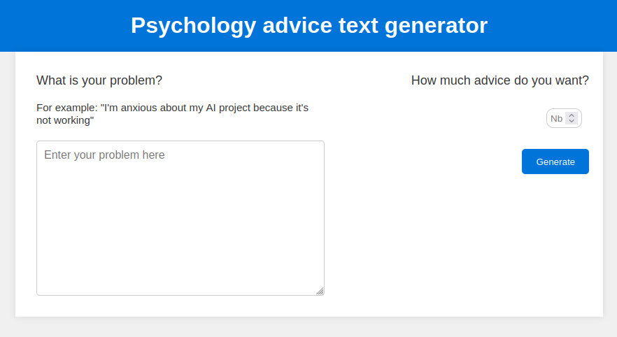

# Overview
The project is a GPT like which give you psychology advices if you suffer of anxiety or other psychological disorders.

WARNING : This chatbot isn't a real solution if you suffer of psycholoogy disorders! It's just a student project. A real psychologist is a better solution.Take care of yourself :)

This project is based on the project from nanoGPT project from Karparthy (https://github.com/karpathy/nanoGPT). Thanks to NLeboucher for the help (https://github.com/NLeboucher).

# By the website
You just need to click on the github link and enjoy with your low-cost psychology chatbot. 
Link : https://dianubv.github.io/psychology_chatbot/

#### The webpage : 

# In local
## Starting 
You need to download some pip package :
``$ pip install -r requirements.txt``

## Training 
##### Prepare the dataset :
For the basic one :
``python data/psychology_char/prepare.py``

For the basic one but based on gpt2 : 
``python data/psychology_char/prepare.py``

For the evil version : 
``python data/psychology_char/prepare.py``

##### Start the training :
For the basic one :
``$ python train.py config/train_psychology.py``

For the basic one but based on gpt2 : 
``$ python train.py config/finetune_psychology.py``

For the evil version : 
``$ python train.py config/train_not_nice.py``

## Testing
##### In the terminal :
``$ python3.10 web.py --out_dir=out-psychology-char``

You can replace the out_dir by the others. 

##### On web (local) :
Open the index.html file in your browser .

